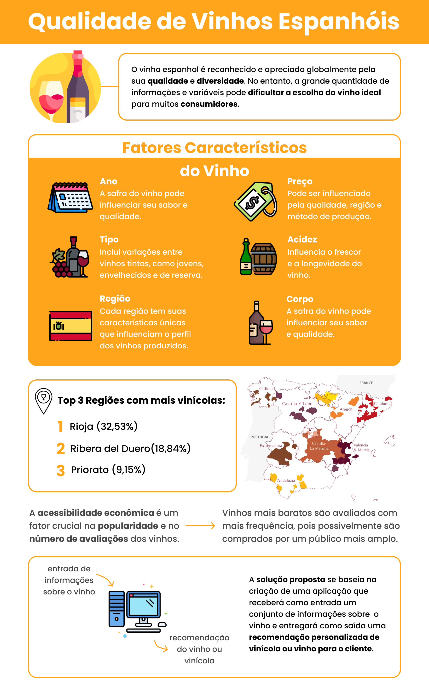

# Análise da Qualidade de Vinhos Espanhóis

Sendo uma bebida apreciada mundialmente, o vinho espanhol é conhecido por sua variedade e qualidade. Assim como outros vinhos, ele pode ser caracterizado por diversos fatores como ano, tipo, preço, nota, região, nível de acidez e corpo do vinho. Dito isso, entender e analisar essa grande quantidade de informações sobre um vinho pode ser uma tarefa complexa para muitos consumidores. Portanto, torna-se relevante a criação de um método auxiliar que, de forma personalizada e de baixo custo, possa ajudar na recomendação de vinhos, facilitando a decisão de compra dos apreciadores de vinho.

O objetivo do projeto é construir uma aplicação que receberá como entrada um conjunto de características dos vinhos e entregará como saída uma recomendação personalizada de vinícola ou vinho para o cliente. Utilizaremos o seguinte conjunto de dados [Spanish Wine Quality](https://www.kaggle.com/datasets/fedesoriano/spanish-wine-quality-dataset/data) relacionado aos vinhos tintos espanhois para a construção do projeto.
 
## Resumo Gráfico



## Desenvolvedores
 - [Giovanna Shiguemori Barbosa](https://github.com/giovannashiguemoribarbosa)
 - [Helena Victória dos Santos Barbosa](https://github.com/Helena190)
 - [Isabelle de Oliveira Reinbold](https://github.com/ReinboldB)
 - [Jennifer Gadelha Barbosa de Menezes](https://github.com/Jenniiu)
 - [Kailany Alves Silva](https://github.com/kailanyas)

---

> **Nota**: todo o texto abaixo é somente para entendimento do usuário do template. Por favor remova-o quando for atualizar este `README.md`.

## Funcionalidades

Esse template foi inicialmente baseado no [template de ciência de dados do cookiecutter](https://drivendata.github.io/cookiecutter-data-science/), mas ao longo do tempo várias modificações foram sendo realizadas. Atualmente o template tem as seguintes características:
 - Utilização do arquivo `pyproject.toml` como centralizador de dependências;
 - Configuração para criação de aplicação `streamlit`;
 - Utilização de [jupyter notebooks](https://jupyter.org/) para arquivos de análise;
 - Documentação com o [mkdocs](https://www.mkdocs.org/) ([material design](https://squidfunk.github.io/mkdocs-material/) theme)

## Instruções

### Requisitos

Para utilizar este template, você precisará de um ambiente com os seguintes softwares:
 - git
 - Python 3.8
 - Poetry `1.1.13` ou superior

É aconselhável o uso do `pyenv` para o gerenciamento de versões do Python.

### Iniciando um novo projeto

Para iniciar um novo projeto você precisa ter instalado na sua máquina as aplicações citadas na seção anterior, depois disso basta:

1. clicar no botão **Use this template** (ou "Usar este modelo").
2. Digitar um nome para seu repositório e uma descrição opcional.
3. Escolher a visibilidade do projeto (Publica ou privada).
4. Clicar em **Create repository from template** (Criar repositório a partir do modelo).

Pronto, acaba de criar um repositório a partir deste modelo. Para mais informações sobre o uso de templates, acesse a [documentação oficial](https://docs.github.com/pt/repositories/creating-and-managing-repositories/creating-a-repository-from-a-template).


### Contribuindo com um repositório já criado

Depois de criar o repositório, para começar a modificá-lo e/ou contribuir com repositórios já criados,  você precisa cloná-lo. Para isso, siga os seguintes passos:

1. Acima da lista de arquivos, clique no botão **Code** (em verde).
2. Copie a URL para o repositório.
    - Tente clonar utilizando uma chave **SSH**. Para isso, clique na aba **SSH** e em seguida clique no ícone de cópia.
3. Abra o terminal.
4. Altere o diretório de trabalho atual para o local que deseja ter o diretório clonado.
5. Digite `git clone` e cole a URL que você copiou anteriormente:

```
git clone git@github.com:NOME-DE-USUARIO/REPOSITORIO.git
```
6. Pressione **Enter** para criar seu clone local.

Proto, com isso você acaba de clonar um repositório. Para mais informações sobre a clonagem de arquivos, acesse a [documentação oficial](https://docs.github.com/pt/repositories/creating-and-managing-repositories/cloning-a-repository).

Com o repositório clonado, você precisa navegar até a pasta local, usando o comando :

```
cd REPOSITORIO
```

Estando na pasta do repositório, basta instalar as dependências do projeto utilizando o comando:

```
poetry install
```

Ele irá instalar todas as dependências contidas no arquivo `pyproject.toml`. Depois disso basta ativar o ambiente virtual criado pelo Poetry utilizando o comando:

```
poetry shell
```

Para mais informações sobre os comandos do Poetry, visite a [documentação oficial](https://python-poetry.org/docs/).

Para contribuir com um projeto, tente utilizar uma metodologia adequada. Utilize [este artigo](https://omadson.github.io/site/blog/2022/software-development-workflow/) para obter mais informações.


### Organização de diretórios


```
.
├── data/              # Diretório contendo todos os arquivos de dados
│   ├── external/      # Arquivos de dados de fontes externas
│   ├── interim/       # Arquivos de dados intermediários
│   ├── processed/     # Arquivos de dados processados
│   └── raw/           # Arquivos de dados originais, imutáveis
├── docs/              # Documentação gerada através da biblioteca mkdocs
├── models/            # Modelos treinados e serializados, predições ou resumos de modelos
├── notebooks/         # Diretório contendo todos os notebooks utilizados nos passos
├── references/        # Dicionários de dados, manuais e todo o material exploratório
├── src/               # Código fonte utilizado nesse projeto
│   ├── data/          # Classes e funções utilizadas para download e processamento de dados
│   ├── deployment/    # Classes e funções utilizadas para implantação do modelo
│   └── model/         # Classes e funções utilizadas para modelagem
├── app.py             # Arquivo com o código da aplicação do streamlit
├── Procfile           # Arquivo de configuração do heroku
├── pyproject.toml     # Arquivo de dependências para reprodução do projeto
├── poetry.lock        # Arquivo com sub-dependências do projeto principal
├── README.md          # Informações gerais do projeto
└── tasks.py           # Arquivo com funções para criação de tarefas utilizadas pelo invoke

```
